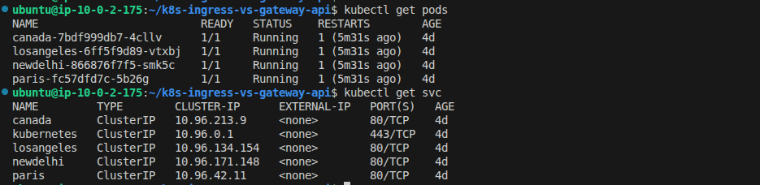
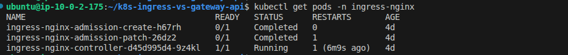
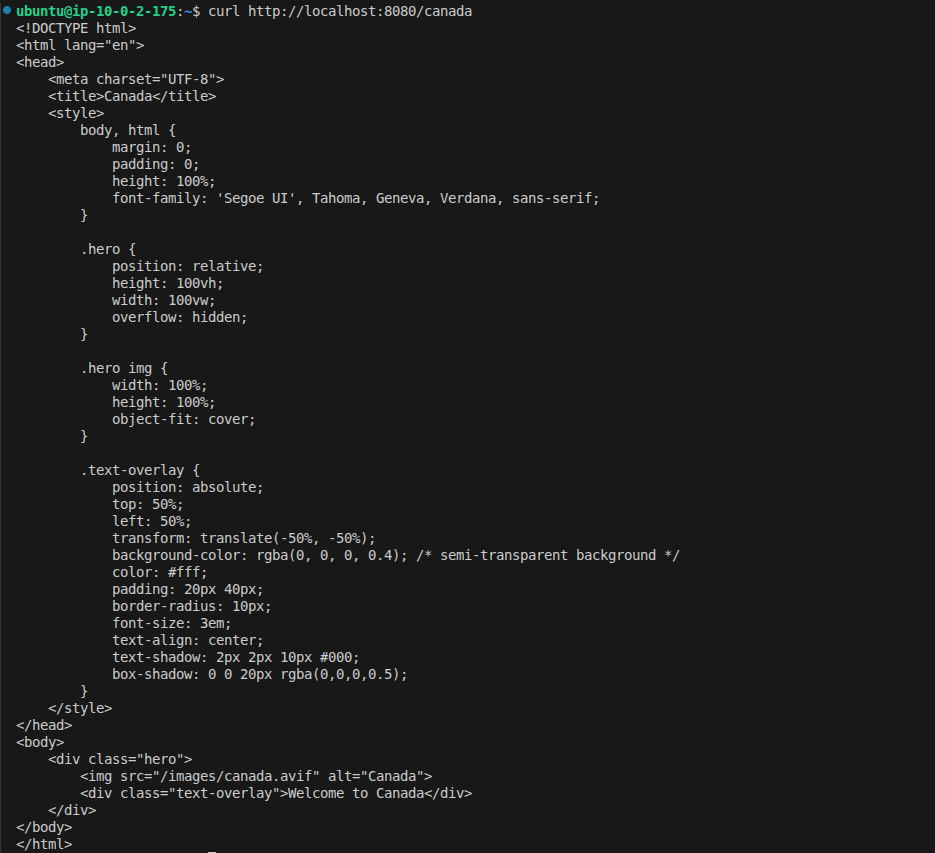
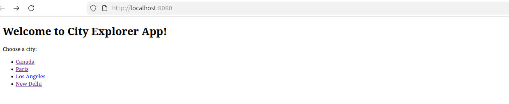
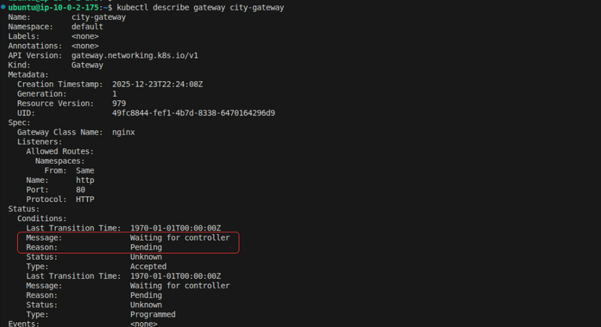
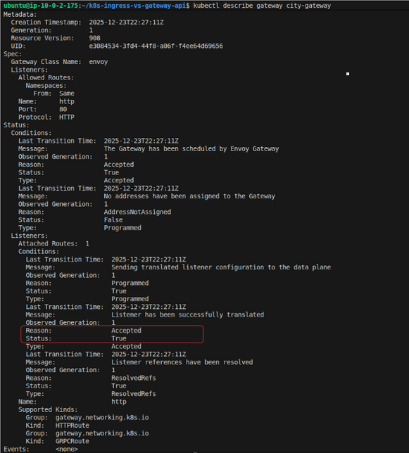
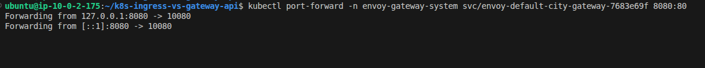
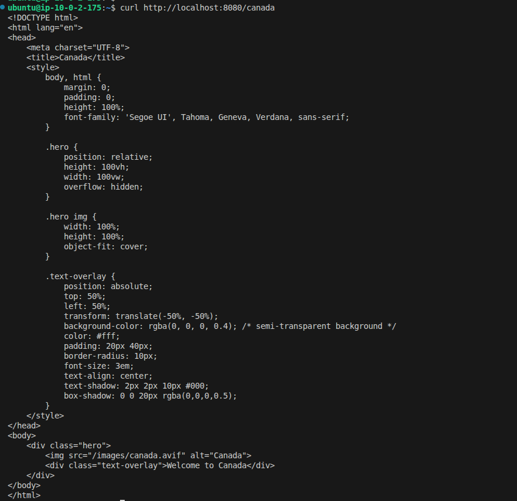

# Kubernetes Ingress vs Gateway API
### NGINX Ingress vs Envoy Gateway (Real-World Comparison) 

This repository demonstrates **two real Kubernetes traffic management scenarios** using **kind (Kubernetes in Docker)**:

1. ❌ **NGINX Ingress + Gateway API** → *Does NOT work as a native Gateway API implementation*
2. ✅ **Envoy Gateway + Gateway API** → *Works as designed and intended*

The goal is to **visually and practically show** why Gateway API needs a **native Gateway controller** (Envoy), and why traditional Ingress controllers (NGINX) are **not suitable** for Gateway API workloads.

---

## 📌 Prerequisites

You need the following tools installed on your machine.

### 1️⃣ Install Docker
```bash
sudo apt update
sudo apt install -y docker.io
sudo usermod -aG docker $USER
newgrp docker
docker version
```
2️⃣ Install kubectl
```bash
curl -LO https://dl.k8s.io/release/$(curl -L -s https://dl.k8s.io/release/stable.txt)/bin/linux/amd64/kubectl
chmod +x kubectl
sudo mv kubectl /usr/local/bin/
kubectl version --client
```
3️⃣ Install kind
```bash
curl -Lo ./kind https://kind.sigs.k8s.io/dl/v0.23.0/kind-linux-amd64
chmod +x kind
sudo mv kind /usr/local/bin/
kind version
```
📁 Clone the Repository
```bash
git clone https://github.com/kapilkumaria/k8s-ingress-vs-gateway-api.git
cd k8s-ingress-vs-gateway-api
```
📂 Repository Structure
```bash
kubernetes/
├── base/                     # Application Deployments & Services
│   ├── deployment.yaml
│   └── service.yaml
├── nginx-ingress/             # Traditional Ingress (NOT Gateway API)
│   ├── ingress.yaml
│   ├── ingress-controller.yaml
│   └── rbac.yaml
├── gateway-api/               # Gateway API with NGINX (FAIL CASE)
│   ├── gatewayclass.yaml
│   ├── gateway.yaml
│   └── httproute.yaml
└── envoy-gateway/             # Gateway API with Envoy (SUCCESS CASE)
    ├── envoy-gateway-install.yaml
    ├── gatewayclass.yaml
    ├── gateway.yaml
    └── httproute.yaml
```
## 🔴 Scenario 1: NGINX Ingress + Gateway API (❌ FAIL CASE)

- This cluster intentionally demonstrates that:
- NGINX Ingress is not a native Gateway API controller

1️⃣ Create Cluster: nginx-gateway-fail
```bash
kind create cluster --name nginx-gateway-fail
kubectl config use-context kind-nginx-gateway-fail
```
2️⃣ Label the Node (IMPORTANT)

NGINX Ingress controller uses a nodeSelector.
```bash
kubectl get nodes
kubectl label node nginx-gateway-fail-control-plane ingress-ready=true
```
3️⃣ Deploy the Application (Services & Pods)
```bash
kubectl apply -f kubernetes/base/
kubectl get pods
kubectl get svc
```


4️⃣ Install NGINX Ingress Controller (Official Way)
```bash
kubectl apply -f https://raw.githubusercontent.com/kubernetes/ingress-nginx/controller-v1.11.1/deploy/static/provider/kind/deploy.yaml
```
Verify:
```bash
kubectl get pods -n ingress-nginx
```


5️⃣ Deploy Traditional Ingress (Works)
```bash
kubectl apply -f kubernetes/nginx-ingress/ingress.yaml
```
Test:
```bash
kubectl port-forward -n ingress-nginx svc/ingress-nginx-controller 8080:80
curl http://localhost:8080/canada
```





6️⃣ Install Gateway API CRDs
```bash
kubectl apply -f https://github.com/kubernetes-sigs/gateway-api/releases/download/v1.0.0/standard-install.yaml
```
7️⃣ Deploy Gateway API Objects (❌ EXPECTED FAILURE)
```bash
kubectl apply -f kubernetes/gateway-api/
```
Check status:
```bash
kubectl describe gateway city-gateway
```
❌ Result

Gateway remains Pending
- NGINX does not reconcile Gateway API
- No dataplane Service created
- No listener address assigned



❌ Conclusion (Scenario 1)

- NGINX is Ingress-first, not Gateway-native
- Gateway API support is experimental / incomplete
- Operationally unsafe for production Gateway API use

## 🟢 Scenario 2: Envoy Gateway + Gateway API (✅ SUCCESS CASE)

This cluster demonstrates how Gateway API is meant to work.

1️⃣ Create Cluster: envoy-gateway-success
```bash
kind create cluster --name envoy-gateway-success
kubectl config use-context kind-envoy-gateway-success
```
2️⃣ Deploy Application
```bash
kubectl apply -f kubernetes/base/
```
3️⃣ Install Gateway API CRDs (Standard + Experimental)
```bash
kubectl apply -f https://github.com/kubernetes-sigs/gateway-api/releases/download/v1.0.0/standard-install.yaml
kubectl apply -f https://github.com/kubernetes-sigs/gateway-api/releases/download/v1.0.0/experimental-install.yaml
```
4️⃣ Install Envoy Gateway (Correct Method)
```bash
kubectl apply -f https://github.com/envoyproxy/gateway/releases/download/v1.0.0/install.yaml
```
Verify:
```bash
kubectl get pods -n envoy-gateway
```


5️⃣ Deploy Gateway API Resources
```bash
kubectl apply -f kubernetes/envoy-gateway/
```
Verify:
```bash
kubectl get gatewayclass
kubectl get gateway
kubectl describe gateway city-gateway
```


6️⃣ Discover the Envoy Data Plane Service
```bash
kubectl get svc -A | grep envoy
```
You will see something like:
```bash
envoy-gateway-system   envoy-default-city-gateway-xxxxx   LoadBalancer   ...   80
```
7️⃣ Port-Forward Envoy Gateway Listener
```bash
kubectl port-forward -n envoy-gateway-system svc/envoy-default-city-gateway-xxxxx 8080:80
```
Test:
```bash
curl http://localhost:8080/canada
curl http://localhost:8080/paris
curl http://localhost:8080/losangeles
curl http://localhost:8080/newdelhi
```




## 🏗 Architecture Diagram

- NGINX Ingress architecture
- Envoy Gateway architecture
- Control plane vs Data plane separation

## 📊 Final Comparison

| Feature                 | NGINX Ingress     | Envoy Gateway |
| ----------------------- | ----------------- | ------------- |
| Gateway API native      | ❌ No              | ✅ Yes         |
| Dataplane auto-creation | ❌ No              | ✅ Yes         |
| Route status visibility | ❌ Limited         | ✅ Full        |
| Production Gateway API  | ❌ Not recommended | ✅ Recommended |

## 🎯 Key Takeaway

- Ingress is legacy. Gateway API is the future.
- Gateway API requires a native Gateway controller, not a traditional ingress controller.

This repo intentionally shows what fails and what succeeds — exactly how real production systems behave.

## 🧹 Cleanup
```bash
kind delete cluster --name nginx-gateway-fail
kind delete cluster --name envoy-gateway-success
```
## ⭐ If you found this useful

Give the repo a ⭐ and connect on LinkedIn for more deep-dive DevOps content.
